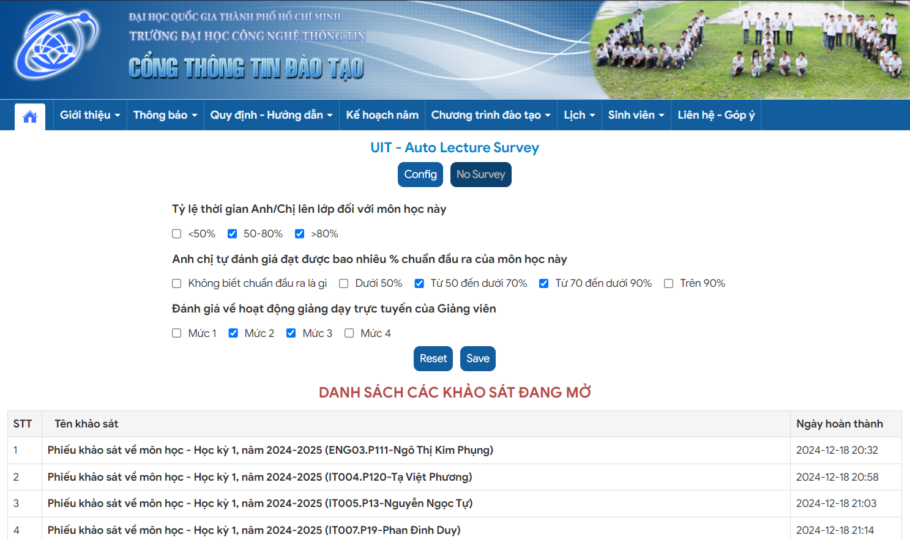

# ✨ UIT - AUTO LECTURE SURVEY ✨

<pre align="center">
██╗   ██╗ █████╗ ██╗     ███████╗
██║   ██║██╔══██╗██║     ██╔════╝
██║   ██║███████║██║     ███████╗
██║   ██║██╔══██║██║     ╚════██║
╚██████╔╝██║  ██║███████╗███████║
 ╚═════╝ ╚═╝  ╚═╝╚══════╝╚══════╝
<strong>UIT - AUTO LECTURE SURVEY</strong>
Script tự động khảo sát môn học UIT
</pre>

> [!IMPORTANT]
>
> Đây là script _(userscript cài đặt qua Tampermonkey)_, không phải tool!

---

## 📃 TABLE OF CONTENTS

<!-- START doctoc generated TOC please keep comment here to allow auto update -->
<!-- DON'T EDIT THIS SECTION, INSTEAD RE-RUN doctoc TO UPDATE -->

- [🎆 CHỨC NĂNG](#-ch%E1%BB%A8c-n%C4%82ng)
- [🪴 HƯỚNG DẪN](#-h%C6%AF%E1%BB%9Ang-d%E1%BA%AAn)
  - [1️⃣ Cài đặt extension Tampermonkey](#-c%C3%A0i-%C4%91%E1%BA%B7t-extension-tampermonkey)
  - [2️⃣ Cài đặt script](#-c%C3%A0i-%C4%91%E1%BA%B7t-script)
  - [3️⃣ Ấn khảo sát](#-%E1%BA%A4n-kh%E1%BA%A3o-s%C3%A1t)
  - [4️⃣ Tắt script khi không sử dụng](#-t%E1%BA%AFt-script-khi-kh%C3%B4ng-s%E1%BB%AD-d%E1%BB%A5ng)
- [📝 LICENSE](#-license)
- [⭐ STAR GRAPH](#-star-graph)

<!-- END doctoc generated TOC please keep comment here to allow auto update -->

## 🎆 CHỨC NĂNG

- Tùy chỉnh lựa chọn trả lời khảo sát _(có random)_
- Tự động điền khảo sát
- Tự động đóng tab khi hoàn thành
- One click điền khảo sát 💪

---

## 🪴 HƯỚNG DẪN

### 1️⃣ Cài đặt extension Tampermonkey

- 
- 
- 
- 
- 

### 2️⃣ Cài đặt script

### 3️⃣ Ấn khảo sát

1. Vào trang khảo sát _(1 trong 2)_
   - https://link.uit.edu.vn/khaosatmh
   - https://student.uit.edu.vn/sinhvien/phieukhaosat
2. Config
3. Sử dụng _(1 trong 2)_:
   - Ấn `Run Auto` để tự động làm hết khảo sát
   - Ấn từng link khảo sát để làm

> [!NOTE]
>
> Tắt Userscript hoặc extension Tampermonkey nếu muốn khảo sát thủ công

### 4️⃣ Tắt script khi không sử dụng

1. `Tampermonkey` _(Extension settings)_
2. `Dashboard`
3. `UIT - Auto Lecture Survey (UALS)`
4. Gạt tắt

> [!IMPORTANT]
>
> Tắt script để tránh xung đột nếu có các khảo sát loại khác

---

## 📝 LICENSE

---

## ⭐ STAR GRAPH

<a href="https://star-history.com/#KevinNitroG/UIT-Auto-Lecture-Survey&Timeline">
  <picture>
    <source media="(prefers-color-scheme: dark)" srcset="https://api.star-history.com/svg?repos=KevinNitroG/UIT-Auto-Lecture-Survey&type=Timeline&theme=dark" />
    <source media="(prefers-color-scheme: light)" srcset="https://api.star-history.com/svg?repos=KevinNitroG/UIT-Auto-Lecture-Survey&type=Timeline" />
    
  </picture>
</a>
